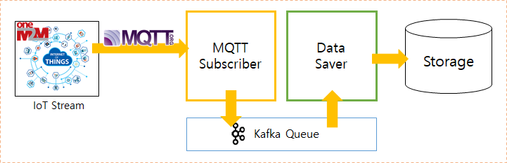

# IoT Harvestor

IoT 센서로 부터 발생하는 데이터를 수집하는 모듈이다.
IoT 표준으로는 OneM2M을 사용하고 있으며, 여기에 사용되는 프로토콜은 MQTT를 사용한다.
Spring Boot를 사용하여 개발하여, API를 통해 모듈을 동작시킨다.

### IoT Harvestor 구조

<p align="center"></p>
   
IoT Harvestor의 모듈은 크게 MQTT Subscriber, Meta Extractor, Data Saver 3가지로 구성되어 있다.
MQTT 프로토콜은 Pub/Sub 구조이기 때문에, 데이터를 가져오기 위해 MQTT Subscriber를 통해 IoT 데이터가 들어오는 MQTT 토픽을 Subscribe 한다.
그리고 subscribe 하여 전송된 IoT 데이터를 다른 곳으로 가져갈 수 있도록 Data Saver로 카프카에 전송하게 된다.
   
   
### 환경 설정
      
IoT Harvestor를 실행시키기 전에 DB 및 카프카와 같은 환경을 설정해야 한다.
설정은 `application.properties` 파일에 입력한다.
```$properties
# MariaDB Config
spring.datasource.driverClassName=
spring.datasource.url=
spring.datasource.username=
spring.datasource.password=

# JPA DB Create Mode (create, create-drop, update, validate, none)
spring.jpa.hibernate.ddl-auto=

# Kafka Config
spring.kafka.broker=
spring.kafka.topic.subscriber=
spring.kafka.topic.metadata=
spring.kafka.topic.destination=

# IntraHarvesting Server Port Setting
server.port=8080
```